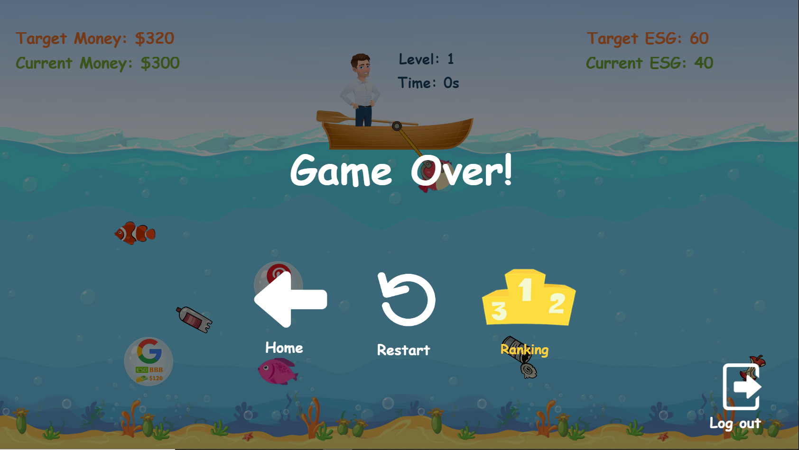

# Fund-Manager-Construct2-Game

This game is developed using Construct2.

Constrct2 is a software that you can easily create games that run in a browser (Construct3 is also available).

Game main file is "Fund Manager.capx" file, it can be exported into html files.

You can download construct2 from here: https://www.construct.net/en/construct-2/download

### Live demo: https://yuan-xie-rakuten-com.solutions.apixplatform.com

After clone this repo, first `npm install` then use `node index.js` to start local application server at port 4200, http://localhost:4200/.

